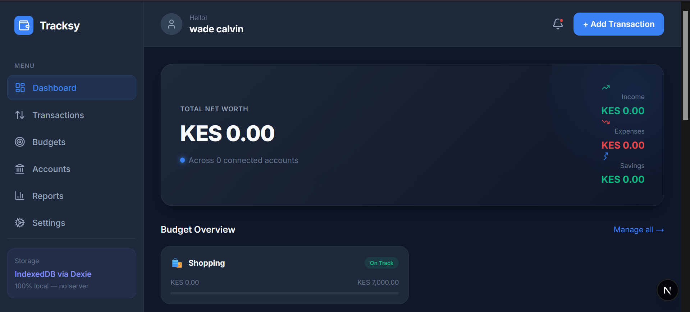

# Tracksy — Modern Personal Finance Tracker

Tracksy is a professional, local-first personal finance application designed to provide a premium and secure experience for managing your money.



## Key Features

- **💎 Professional Dashboard**: A high-end financial overview featuring a dynamic Net Worth banner, interactive budget tracking, and real-time spending insights.
- **🏦 Account Management**: Securely track multiple financial accounts including Cash, Savings, and Credit Cards with real-time balance updates.
- **💸 Transaction Tracking**: Effortlessly log income and expenses with categorized records, searchable history, and quick-action filters.
- **🎯 Smart Budgeting**: Set spending limits for different categories and monitor your progress with visual indicators to stay on track.
- **📊 Detailed Reports**: Gain insights into your financial habits with historical spending charts and category breakdowns.
- **⚙️ Advanced Personalization**:
    - **Global Currency Support**: Choose your preferred currency (KSH, USD, EUR, GBP, etc.) to be used throughout the app.
    - **Profile Customization**: Personalize your experience with a custom display name.
- **📱 True Responsive Design**: A seamless experience across all devices, from desktop browsers to mobile phones with a dedicated bottom navigation bar.
- **🔒 Local & Private**: Your financial data never leaves your device. Everything is stored locally using IndexedDB (Dexie.js).

## Tech Stack

- **Framework**: [Next.js](https://nextjs.org) (App Router)
- **Language**: [TypeScript](https://www.typescriptlang.org)
- **Database**: [Dexie.js](https://dexie.org) (IndexedDB wrapper)
- **Icons**: [Lucide React](https://lucide.dev)
- **Styling**: Vanilla CSS with a custom-built, professional design system

## Getting Started

First, run the development server:

```bash
npm install
npm run dev
```

Open [http://localhost:3000](http://localhost:3000) with your browser to see the result.

## Development

- `app/`: Next.js application structure.
- `components/`: Modular React components for the dashboard, settings, and navigation.
- `lib/db.ts`: Database schema and helper functions.
- `app/globals.css`: Core design system and global styles.

---
Built with ❤️ for better financial clarity.
